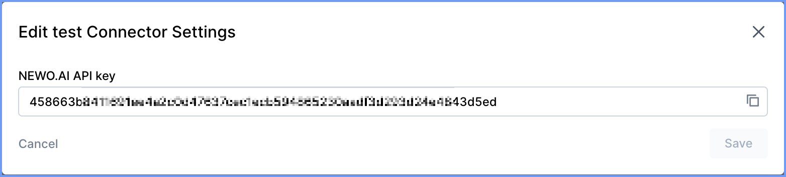

# NEWO CLI

Mirror NEWO "Project → Agent → Flow → Skills" to local files and back, Git-first.

## Install

### Option 1: Global Installation (Recommended)
```bash
npm install -g newo
```
After global installation, use the CLI anywhere:
```bash
newo pull
newo push
newo status
```

### Option 2: Local Installation
```bash
# In your project directory
npm install newo
```
Use with npx:
```bash
npx newo pull
npx newo push  
npx newo status
```

### Option 3: Development Installation
```bash
# Clone the repository
git clone https://github.com/sabbah13/newo-cli.git
cd newo-cli
npm install
npm run build    # Build TypeScript to JavaScript
```

## Configure

### Step 1: Get Your NEWO API Key
1. **Login** to your [app.newo.ai](https://app.newo.ai) account
2. **Navigate** to the **Integrations** page
3. **Find** the **API Integration** in the list
4. **Create** a new **Connector** for this Integration
5. **Copy** your API key (it will look like: `458663bd41f2d1...`)



### Step 2: Setup Environment
```bash
cp .env.example .env
# Edit .env with your values
```

Required environment variables:
- `NEWO_BASE_URL` (default `https://app.newo.ai`)
- `NEWO_API_KEY` (your API key from Step 1)

Optional environment variables:
- `NEWO_PROJECT_ID` (specific project UUID - if not set, pulls all accessible projects)
- `NEWO_ACCESS_TOKEN` (direct access token)
- `NEWO_REFRESH_TOKEN` (refresh token)
- `NEWO_REFRESH_URL` (custom refresh endpoint)

## Commands
```bash
npx newo pull                              # download all projects -> ./projects/ OR specific project if NEWO_PROJECT_ID set
npx newo status                            # list modified files
npx newo push                              # upload modified *.guidance/*.jinja back to NEWO
npx newo import-akb <file> <persona_id>    # import AKB articles from file
npx newo meta                              # get project metadata (debug, requires NEWO_PROJECT_ID)
```

### Project Structure
Files are stored as:
- **Multi-project mode** (no NEWO_PROJECT_ID): `./projects/<ProjectIdn>/<AgentIdn>/<FlowIdn>/<SkillIdn>.guidance|.jinja`
- **Single-project mode** (NEWO_PROJECT_ID set): `./projects/<ProjectIdn>/<AgentIdn>/<FlowIdn>/<SkillIdn>.guidance|.jinja`

Each project folder contains:
- `metadata.json` - Project metadata (title, description, version, etc.)
- `flows.yaml` - Complete project structure export for external tools
- Agent/Flow/Skill hierarchy with `.guidance` (AI prompts) and `.jinja` (NSL templates)

Hashes are tracked in `.newo/hashes.json` so only changed files are pushed.

## Features
- **Multi-project support**: Pull all accessible projects or specify a single project
- **Two-way sync**: Pull NEWO projects to local files, push local changes back
- **Change detection**: SHA256 hashing prevents unnecessary uploads
- **Multiple file types**: `.guidance` (AI prompts) and `.jinja` (NSL templates)
- **Project metadata**: Each project includes `metadata.json` with complete project info
- **AKB import**: Import knowledge base articles from structured text files
- **Project structure export**: Generates `flows.yaml` with complete project metadata
- **Robust authentication**: API key exchange with automatic token refresh
- **CI/CD ready**: GitHub Actions workflow included

## CI/CD (GitHub Actions)
Create `.github/workflows/deploy.yml`:
```yaml
name: Deploy NEWO Skills
on:
  push:
    branches: [ main ]
    paths:
      - 'projects/**/*.guidance'
      - 'projects/**/*.jinja'
jobs:
  deploy:
    runs-on: ubuntu-latest
    steps:
      - uses: actions/checkout@v4
      - uses: actions/setup-node@v4
        with:
          node-version: 20
      - run: npm ci
      - run: npm run build && node ./dist/cli.js push
        env:
          NEWO_BASE_URL: https://app.newo.ai
          NEWO_PROJECT_ID: ${{ secrets.NEWO_PROJECT_ID }}
          NEWO_API_KEY: ${{ secrets.NEWO_API_KEY }}
          # Optional:
          # NEWO_REFRESH_URL: ${{ secrets.NEWO_REFRESH_URL }}
```

## AKB Import

Import knowledge base articles from structured text files into NEWO personas:

```bash
npx newo import-akb akb.txt da4550db-2b95-4500-91ff-fb4b60fe7be9
```

### AKB File Format
```
---
# r001
## Category / Subcategory / Description
## Summary description of the category
## Keywords; separated; by; semicolons

<Category type="Category Name">
Item Name: $Price [Modifiers: modifier1, modifier2]
Another Item: $Price [Modifiers: modifier3]
</Category>
---
```

Each article will be imported with:
- **topic_name**: The descriptive category title
- **source**: The article ID (e.g., "r001") 
- **topic_summary**: The full category content with pricing
- **topic_facts**: Array containing category, summary, and keywords
- **confidence**: 100
- **labels**: ["rag_context"]

Use `--verbose` flag to see detailed import progress.

## Development

This project is built with TypeScript for enhanced type safety and developer experience.

### Development Commands
```bash
# Build TypeScript to JavaScript
npm run build

# Build and watch for changes
npm run build:watch

# Run CLI commands (after building)
npm run dev pull                    # Build and run pull command
npm run pull                        # Build and run pull command
npm run push                        # Build and run push command
npm run status                      # Build and run status command

# Type checking without emitting files
npm run typecheck

# Run tests
npm test
```

### Project Structure
- `src/` - TypeScript source files
- `dist/` - Compiled JavaScript output (generated by `npm run build`)
- `test/` - Test files
- `projects/` - Downloaded NEWO projects (generated by pull command)
- `.newo/` - CLI state directory (tokens, hashes, mappings)

### TypeScript Features
- Full type safety with strict TypeScript configuration
- Modern ES2022 target with ESNext modules
- Comprehensive type definitions for all NEWO API responses
- Enhanced error handling and validation
- IntelliSense support in compatible IDEs

## API Endpoints
- `GET /api/v1/designer/projects` - List all accessible projects
- `GET /api/v1/designer/projects/by-id/{projectId}` - Get specific project metadata
- `GET /api/v1/bff/agents/list?project_id=...` - List project agents
- `GET /api/v1/designer/flows/{flowId}/skills` - List skills in flow
- `GET /api/v1/designer/skills/{skillId}` - Get skill content
- `PUT /api/v1/designer/flows/skills/{skillId}` - Update skill content
- `GET /api/v1/designer/flows/{flowId}/events` - List flow events (for flows.yaml)
- `GET /api/v1/designer/flows/{flowId}/states` - List flow states (for flows.yaml)
- `POST /api/v1/auth/api-key/token` - Exchange API key for access tokens
- `POST /api/v1/akb/append-manual` - Import AKB articles