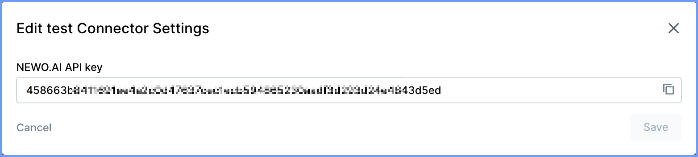

# NEWO CLI

[](https://badge.fury.io/js/newo)
[](https://opensource.org/licenses/MIT)
[](https://www.typescriptlang.org/)
[](https://nodejs.org/)

**NEWO CLI** - Professional command-line tool for NEWO AI Agent development. Features **modular architecture**, **IDN-based file management**, and **comprehensive multi-customer support**.

Sync NEWO "Project → Agent → Flow → Skills" structure to local files with:
- 🆕 **Attribute point-edit** (v3.8.1) - `newo update-attribute <idn> --value <val>` edits one attribute (customer or `--project` scope) while preserving all metadata (`is_read_only`, title, `possible_values`, `value_type`); `--file` for long values, `--json` output, JSON-value safe
- 🆕 **Faithful JSON-attr Markdown escapes** (v3.7.7) - canvas/JSON attributes preserve `\_` Markdown escapes through pull/push (escaped, not dropped), so escaped underscores no longer render as italics in the Workflow Builder
- 🆕 **Project version & force-update** (v3.7.6) - `newo update-project <idn> --version <semver>` sets the displayed Builder project version after a deploy; `--force-update` re-syncs the project from its registry (the Builder's "Force Update Project" action)
- 🆕 **Get one session** (v3.7.6) - `newo session <uuid>` pulls one session's dialog (transcript + agent `THOUGHTS` + system logs) by its platform `session_id`; add `--full` for the low-level skill-call execution trace
- 🆕 **V2 skill creation on push** (v3.7.4) - adding a skill inline to a `newo_v2` `{FlowIdn}.yaml` and pushing now creates it on the platform (previously only updates of existing skills worked)
- 🆕 **Agent scenario tests** (v3.8.0) - `newo test <scenario.yaml>` runs a scripted multi-turn conversation against a live sandbox agent with per-turn assertions (`contains`/`not_contains`/`regex`), fail-fast reporting, `--json` CI output and `newo logs` correlation
- 🆕 **Sandbox connector selection + automation** (v3.7.5) - `newo sandbox --connector <idn>`, `--list-connectors`, `--file`/`--stdin` for long messages, `--timeout`, and `--json` with `external_event_id` for log correlation
- 🆕 **Point skill edits** (v3.7.5) - `newo get-skill` / `newo update-skill` inspect and modify a single skill (model, script) on the platform without a pulled workspace, with optional `--publish`
- 🆕 **Canvas blank-screen hardening** (v3.7.3) - JSON-typed attributes (e.g. Workflow Builder canvas) with Markdown `\_` escapes or structural newlines no longer corrupt the canvas on push ([#7](https://github.com/sabbah13/newo-cli/pull/7))
- 🆕 **Flow metadata sync** (v3.7.2) - `newo push` now reconciles flow title, events, and state_fields from local `metadata.yaml` to the platform (closes [#3](https://github.com/sabbah13/newo-cli/issues/3))
- 🆕 **Dual format support** (v3.6.0) - `cli_v1` (native) and `newo_v2` (platform compatible), auto-detected per customer
- 🆕 **Libraries** (v3.6.0) - Pull/push shared reusable skills across agents within a project
- 🆕 **Bulk export** (v3.6.0) - `newo export` downloads complete V2 ZIP from platform
- 🚀 **Account migration** - Fully automated account copying with 100% accuracy
- 🏗️ **Complete entity management** - Create, edit, and delete agents, flows, skills, events, and states
- 🔄 **Intelligent synchronization** - Pull projects, attributes, and conversations automatically
- 🎯 **IDN-based naming** - Skills named as `{skillIdn}.jinja/.guidance` or `{skillIdn}.nsl/.nslg`
- 📊 **Real-time progress** - Live progress tracking during large operations (1,000+ skills)
- 🏢 **Multi-customer workspaces** - Work with multiple NEWO accounts simultaneously
- 🔐 **Secure authentication** - API key-based auth with automatic token refresh
- ⚡ **Smart change detection** - SHA256-based efficient sync with hash consistency
- 🧠 **AI skill formats** - Support for `.guidance`/`.jinja` (V1) and `.nslg`/`.nsl` (V2)
- 📡 **Webhook automation** - Automatic webhook creation from YAML configuration
- 📊 **Knowledge base import** - Bulk import AKB articles from structured text files
- 💬 **Conversation history** - Extract and sync user conversations and personas
- 🧪 **Sandbox testing** - Interactive agent testing with conversation continuation
- 🔧 **CI/CD ready** - GitHub Actions integration for automated deployments

---

## Quick Start

### Installation

**Option 1: Global Installation (Recommended)**
```bash
npm install -g newo@latest
```

**Option 2: Local Project Installation**
```bash
npm install newo
```

**Option 3: Development from Source**
```bash
git clone https://github.com/sabbah13/newo-cli.git
cd newo-cli
npm install && npm run build
```

### Basic Setup

1. **Get your NEWO API key** from [app.newo.ai](https://app.newo.ai) → Integrations → API Integration → Create Connector
2. **Configure environment**:
   ```bash
   cp .env.example .env
   # Edit .env with your API key
   ```
3. **Start syncing**:
   ```bash
   newo pull    # Download all projects
   newo push    # Upload changes back
   newo status  # See what's modified
   ```

4. **Create entities** (NEW v2.0+):
   ```bash
   newo create-agent MyBot --project <project-idn>    # Create agent locally
   newo create-flow MainFlow --agent MyBot --project <project-idn>  # Create flow
   newo push && newo pull   # Sync to platform
   ```

---

## Configuration

### Single Customer Setup

For working with one NEWO account:

```bash
# .env file
NEWO_API_KEY=your_api_key_here
NEWO_PROJECT_ID=project_uuid_here  # Optional: specific project only
```

### Multi-Customer Setup

Work with multiple NEWO accounts simultaneously using three flexible approaches:

#### Method 1: JSON Array (Recommended)
```bash
# .env file
NEWO_API_KEYS=["api_key_customer_1", "api_key_customer_2", "api_key_customer_3"]
NEWO_DEFAULT_CUSTOMER=NEWO_ABC123  # Optional: set after first pull
```

#### Method 2: JSON Array with Project IDs
```bash
# .env file
NEWO_API_KEYS=[
  {"key":"api_key_1","project_id":"project_uuid_1"},
  {"key":"api_key_2","project_id":"project_uuid_2"},
  {"key":"api_key_3"}
]
```

#### Method 3: Individual Environment Variables
```bash
# .env file
NEWO_CUSTOMER_ACME_API_KEY=acme_api_key_here
NEWO_CUSTOMER_BETA_API_KEY=beta_api_key_here
NEWO_CUSTOMER_GAMMA_API_KEY=gamma_api_key_here
```

### Getting Your NEWO API Keys

1. **Login** to [app.newo.ai](https://app.newo.ai)
2. **Navigate** to **Integrations** page
3. **Find** **API Integration** in the list
4. **Create** a new **Connector** 
5. **Copy** the API key (format: `458663bd41f2d1...`)



### Advanced Configuration

```bash
# .env file
NEWO_BASE_URL=https://app.newo.ai          # NEWO platform URL
NEWO_DEFAULT_CUSTOMER=NEWO_ABC123          # Default customer for operations
NEWO_ACCESS_TOKEN=direct_access_token      # Alternative to API key
NEWO_REFRESH_TOKEN=refresh_token_here      # For token refresh
NEWO_REFRESH_URL=custom_refresh_endpoint   # Custom refresh endpoint
```

---

## Commands

### Core Commands

| Command | Description | Features |
|---------|-------------|----------|
| `newo pull [--format <fmt>]` | Download projects + attributes + libraries | • Dual format: `cli_v1` / `newo_v2`<br>• Auto-detects format per customer<br>• Real-time progress tracking (1,000+ skills)<br>• IDN-based file naming<br>• `--force` for silent overwrite |
| `newo push [--format <fmt>]` | Upload local changes to NEWO | • Works with both formats<br>• Hash-based change detection<br>• Library skill updates<br>• Publishes flows automatically |
| `newo status [--format <fmt>]` | Show modified files | • Format-aware status<br>• Multiple file warnings<br>• Per-customer status |
| `newo export [--output <file>]` | Download V2 bulk ZIP from platform | • Complete organization export<br>• Projects, agents, flows, skills, attributes, AKB<br>• Compatible with platform UI import |
| `newo sandbox` | Test agents in sandbox chat mode | • Single-command mode for automation<br>• Multi-turn conversation support<br>• Debug info for agent development<br>• v3.7.5: `--connector`, `--list-connectors`, `--file`/`--stdin`, `--timeout`, `--json` |
| `newo test <scenario.yaml>` | Scripted multi-turn agent scenario tests (NEW v3.8.0) | • YAML-based scenario definition<br>• Single shared conversation per run<br>• Per-turn assertions: `contains`, `not_contains`, `regex`<br>• Fail-fast with skipped turns reported<br>• Connector selection (--connector, --integration, --timeout)<br>• --json output with log correlation IDs<br>• --customer for multi-customer setups |
| `newo get-skill` / `newo update-skill` | Inspect / point-edit one skill on the platform (NEW v3.7.5) | • No pulled workspace required<br>• `--model <provider>/<model>`, `--script <file>`<br>• Optional `--publish` |
| `newo conversations` | Pull conversation history | • User personas and chat history<br>• YAML format output<br>• Pagination support<br>• v3.7.6: `--session-id <uuid>` pulls one session's transcript |
| `newo session <uuid>` | Inspect one session | • ⭐ Dialog view by default (transcript + `THOUGHTS` + system logs), fast<br>• `--full` adds the skill-call execution trace (`--max-logs`, `--pad-end`)<br>• `--json` for piping |
| `newo list-customers` | List configured customers | • Shows default customer<br>• Multi-customer discovery |
| `newo import-akb` | Import knowledge base articles | • Structured text parsing<br>• Bulk article import<br>• Validation and error reporting |
| `newo meta` | Get project metadata (debug) | • Project structure analysis<br>• Metadata validation |

### Sandbox Connector Selection & Automation (NEW v3.7.5)

`newo sandbox` previously always chatted through the **first** running connector of the `sandbox` integration, making other agents (e.g. a Vibe Builder behind a `vibe_agent` connector) unreachable from the CLI. v3.7.5 adds connector selection plus automation-friendly I/O:

```bash
newo sandbox --list-connectors                          # show running sandbox connectors
newo sandbox "ping" --connector vibe_agent              # chat through a specific connector
newo sandbox "ping" --integration sandbox --connector vibe_agent   # explicit pair (default integration: sandbox)

newo sandbox --file ./chunk1.txt --actor <id> --json    # long message from file, machine-readable output
cat chunk1.txt | newo sandbox --stdin --actor <id>      # message from stdin
newo sandbox "ping" --timeout 420                       # wait up to 7 minutes for slow agent turns (default: 60s)
```

`--json` output includes the correlation keys for `newo logs`:

```json
{
  "actor_id": "…", "persona_id": "…", "connector_idn": "vibe_agent",
  "external_event_id": "…",          // user turn — use with: newo logs --event-id <id>
  "user_external_event_id": "…", "agent_external_event_id": "…",
  "response": "…", "elapsed_ms": 12345, "timed_out": false,
  "flow_idn": "VibeFlow", "skill_idn": "…", "session_id": "…"
}
```

Without `--connector`, behavior is unchanged (first running connector), so existing scripts keep working. When the requested connector is missing, the error lists the available running connectors.

This makes agent integration tests scriptable in plain bash: send chunks via `newo sandbox --file … --json`, then verify behavior via `newo logs --event-id … --json` — no more ad-hoc Node scripts importing `dist/api.js`.

### Point Skill Inspection & Edits (NEW v3.7.5)

Inspect or modify a **single skill** directly on the platform by IDN path — no pulled `newo_customers/` workspace required, nothing else gets touched:

```bash
# What lives on the platform right now? (model, runner_type, parameters, prompt_script)
newo get-skill structured_generation --project vibe --agent VibeAgent --flow VibeFlow [--json]

# Temporarily switch a model, publish, run tests, switch back:
newo update-skill structured_generation --project vibe --agent VibeAgent --flow VibeFlow \
    --model google/gemini25_pro --publish
# …run your tests…
newo update-skill structured_generation --project vibe --agent VibeAgent --flow VibeFlow \
    --model openai/gpt54 --publish

# Replace a skill script from a file (draft only, without --publish):
newo update-skill get_memory --project vibe --agent VibeAgent --flow VibeFlow --script ./patched.nsl
```

- `--model <provider_idn>/<model_idn>` and `--script <file>` can be combined; everything else (title, parameters, runner) is preserved.
- `--publish` publishes the flow after the update (same as push); without it the change stays draft. `--publish-description "<text>"` sets the publish note.
- If a pulled local workspace exists for the project, the CLI warns that it now diverges from the platform.

### Agent Scenario Tests (NEW v3.8.0)

Run scripted multi-turn conversations against a live sandbox agent and assert on each turn's reply. Compose only existing plumbing (`sandbox/chat.ts`, chat history, logs correlation) - no new backend endpoints.

```yaml
name: order status happy path        # optional; defaults to file basename
connector: vibe_agent                # optional; CLI --connector overrides
integration: sandbox                 # optional; CLI --integration overrides
timeout: 90                          # optional, seconds; scenario-level default
turns:
  - message: "Hi"
    expect:
      contains: "Hello"              # string or list; AND semantics
  - message: "Where is my order 123?"
    timeout: 120                     # per-turn override
    expect:
      contains: ["order", "123"]
      not_contains: "error"
      regex: "order\\s+#?123"        # JS RegExp, no flags (case-sensitive)
```

Run and verify:

```bash
newo test ./scenarios/order-status.yaml                     # human output, exit 0 all-pass, 1 on failure
newo test ./scenarios/order-status.yaml --json              # machine-readable per-turn report
newo test ./scenarios/order-status.yaml --connector vibe_agent   # target a specific connector
newo test ./scenarios/order-status.yaml --timeout 300       # scale response budget (per-turn overrides this)
```

**CI budget note:** each scenario runs serially; worst case is `turns x timeout` (all turns hit their timeout budget). Mitigate with per-turn timeouts, and remember CI runners may be slower than your dev machine. Failure on any turn aborts remaining turns (no flaky retries or continued-on-error modes in v1).

**`--json` error contract:** any failure - setup (bad args, malformed scenario, no connector, auth error) or an unexpected error mid-run - prints exactly one JSON object of the shape `{ error: string, phase: "setup" | "run", file: string | null }` to stdout and exits 1, instead of a `turns`-shaped result.

**Known limitations:**
- Persona and actor created per run are not deleted after the scenario finishes (matches existing `newo sandbox` behavior; no delete endpoint exists).
- Agent replies in multiple chat bubbles are joined (`\n`) and assertions run against all bubbles together. Replies arriving during turn N+1's poll window could bleed into N+1's result (rare; `pollForResponse` already filters by `datetime > sentAt - 100ms`).

### Logs: Action-Name Filter (NEW v3.7.5)

```bash
newo logs --type call --name Gen --json        # only Gen action calls
newo logs --name GetMemory --hours 24          # only GetMemory calls, last 24h
newo logs --type call --raw | jq '.data.name'  # JSONL stream, one log per line, for piping
```

`--name` filters by `data.name` client-side (the API has no such query param). Note: the **model used for a turn** is in `data.source.model` of the `--json` output — do not infer it from actor/agent names.

`--raw` emits **JSONL** — one JSON object per log line (oldest-first), with no banners or "no logs found" text — so stdout is a clean stream for `jq`/piping. This differs from `--json`, which prints a single pretty-printed JSON array.

### Logs: ID Filters

```bash
newo logs --agent-persona-id <uuid>              # logs for one agent persona
newo logs --persona-id <uuid>                    # logs for one user persona
newo logs --actor-id <uuid>                      # logs for one user actor
newo logs --event-id <uuid>                      # logs for one external event (correlates a chat turn; see newo sandbox --json)
newo logs --runtime-id <uuid>                    # logs for one runtime context
```

These map 1:1 onto the `agent_persona_ids` / `user_persona_ids` / `user_actor_ids` / `external_event_id` / `runtime_context_id` query params the analytics logs API accepts, and mirror the filter fields in the Builder UI's own Conversations → **Show Logs** panel (`Agent`, the `User: Persona`/`Actor` toggle, `External Event Id`, `Runtime Context Id`). Each flag takes a single UUID (no comma-separated lists, unlike `--level`/`--type`).

### Get One Session (NEW v3.7.6)

Inspect a **single conversation session** by its platform `session_id` (the Session Id from an assessor report or the Conversations UI). The short command is `newo session <uuid>`.

#### ⭐ Recommended: the dialog view (fast)

```bash
newo session 30557d03-4542-41ba-9413-7d9e1a19e364        # save conversation-<id>.yaml + print the dialog
newo session <uuid> --json > session.json               # machine-readable, to stdout
newo session <uuid> --customer <idn>                     # pick account in multi-customer setups
```

This is the default and what you want **first**. It's fast (one `chat/history` fetch, no log scan). For **some** sessions the resolved actor's `chat/history` also includes the agent's **`THOUGHTS:`** reasoning and **system-log** lines (booking payloads, availability, SMS, the end-of-session summary) — but this varies by session/persona: other sessions return only the spoken turns. The richer narrative (formatted `thoughts_footnote`, `analyze_conversation`, the report) lives in the UI-only `acts` layer, which is not api-key-reachable (see below). The `--json` shape is `{ session_id, personas[], actor_ids[], total_acts, acts[] }`, each act `{ datetime, speaker: "agent"|"user", type, message, … }`, oldest-first.

#### `--full`: add the low-level execution trace (heavier)

```bash
newo session <uuid> --full                  # dialog + every skill/NSL call (flow_idn, skill_idn, model, timing)
newo session <uuid> --full --max-logs 3000  # cap the trace fetch (default 20000); progress is printed as it runs
newo session <uuid> --full --pad-end 20     # collect logs up to 20 min past the last turn (post-call report)
```

Use `--full` only when you need the under-the-hood trace. A busy session can have **tens of thousands** of skill calls, so the trace is fetched with progress output and bounded by `--max-logs` (default 20000; `partial: true` is set when the cap is hit). Output: `conversation-<id>-full.yaml` with a merged `timeline[]` of dialog messages (`kind: message`) and trace entries (`kind: call`/`operation`), linked by `external_event_id`.

> Long form: `newo conversations --session-id <uuid> [--full]` is identical to `newo session <uuid> [--full]`.

**How it resolves** (works with an api-key token): `user-personas?session_id=<id>` finds the persona/actor, then `chat/history?user_actor_id=<id>` returns the transcript and `analytics/logs` (scoped to the actor within the session window) the trace. The direct `acts?session_id=<id>` endpoint — the one the Builder UI uses for its full chronicle — needs a logged-in user token (its api-key token has an empty `account_id` and the endpoint hangs), so a few UI-only act layers (formatted `analyze_conversation`, recordings) are not included; see [docs/SESSION_CHRONICLE_PLATFORM_ASK.md](docs/SESSION_CHRONICLE_PLATFORM_ASK.md). Everything is scoped to the resolved actor(s); service actors (`program_timer`, `magic_browser`) are excluded. The session must belong to the **configured account**.

### Project Version & Force-Update (NEW v3.7.6)

After deploying a project template into a customer account, the **displayed project version** in the Builder (`builder.newo.ai/projects`) can stay stale. `newo update-project` sets it so the label matches what was deployed:

```bash
newo update-project naf --version 4.5.2                         # set the displayed version
newo update-project naf --version 4.5.2 --json                  # machine-readable effective state
newo update-project naf --force-update                          # re-sync project content from its registry
newo update-project naf --force-update --version 4.5.2          # force-update, then set the label
newo update-project naf --version 4.5.2 --auto-update false     # also change other project fields
```

**What sets the version:** the displayed value is the project's `version` field — **not** `registry_item_version`, and **not** content push (`newo push` never writes it). Setting it is a pure metadata/label update: it does **not** pull or re-sync skills/flows/attributes, so it composes cleanly right after a content push.

**How it works:** the platform's single-project resource is `by-id/{id}`, and its PATCH is **not** a true partial (an empty body flips `is_auto_update_enabled` to `false`). So the command **GETs** the current meta, overlays only the requested fields, and **PATCHes the full object back** — mirroring the Builder's "Manage → update to <version>" call.

**`--force-update`** fires the Builder's "Force Update Project" action (`POST /api/v1/designer/projects/by-id/{id}/force-update`), re-syncing the project's content from its registry. It can run standalone or alongside `--version`; when combined, force-update runs **first** so an explicit `--version` still wins the displayed label. At least one of `--version` (/other fields) or `--force-update` must be passed.

`--json` emits `{ idn, version, registry_item_version, is_auto_update_enabled, force_updated }`. Non-published versions trigger a non-fatal warning (you may be labeling a working-copy version).

### Flow Metadata Sync (NEW v3.7.2)

`newo push` now reconciles **flow-level metadata** — title, `events:`, and `state_fields:` — from local YAML to the platform. Before v3.7.2 push only uploaded skill scripts, so edits to a flow's `metadata.yaml` (V1) or `{FlowIdn}.yaml` (V2) silently never reached the platform; events added via `newo create-event` could appear to disappear after a pull → push cycle. Closes [#3](https://github.com/sabbah13/newo-cli/issues/3).

**How it works:**

| Local change in `metadata.yaml` | What push does |
|---|---|
| `title:` changed | `PATCH /api/v1/designer/flows/{id}` with full descriptor |
| New event in `events:` | `POST /api/v1/designer/flows/{id}/events` |
| Event field edited | `PATCH /api/v1/designer/flows/events/{eventId}` |
| Event removed from list | `DELETE /api/v1/designer/flows/events/{eventId}` |
| Same for `state_fields:` | Mirrored CRUD against `/states` |

**Safety:**

- **Hash-gated**: flows whose `metadata.yaml` SHA256 is unchanged are *not* compared against the platform. Stale local trees cannot wipe events you created via the Builder UI.
- **Full sync on changed flows**: when you *do* edit `metadata.yaml`, local becomes the source of truth for that flow. Events present on the platform but missing locally are deleted. To keep events created out-of-band, run `newo pull` before editing.
- **Push output**: changed flows print `↑ Flow <flow>: events +N/~N/-N, states +N/~N/-N` so you see exactly what synced.

**Available in:** legacy V1 push path (`pushChanged`), `ProjectSyncStrategy`, and `V2ProjectSyncStrategy`. Works the same with `newo push --format cli_v1` and `--format newo_v2`.

### Lint, Format, Check (NEW v3.7.0)

Static-analysis over DSL files, powered by [`newo-dsl-analyzer`](https://www.npmjs.com/package/newo-dsl-analyzer). Same engine that runs in the VS Code extension - no drift between editor and CI.

| Command | Description |
|---------|-------------|
| `newo lint [paths...]` | Lint Guidance / Jinja / NSL / NSLG files. Exit 0 clean, 1 findings, 2 runtime error. |
| `newo format [paths...]` | Apply canonical formatting in place. Use `--check` to only report (no writes). |
| `newo check [paths...]` | Umbrella: runs `lint` then `format --check`. Single CI gate. |

**Lint flags:**

| Flag | Purpose |
|------|---------|
| `--format <cli_v1\|newo_v2>` | Restrict file extensions to one format's set |
| `--reporter <text\|json\|sarif>` | Output format. `sarif` is ready for GitHub Code Scanning |
| `--max-warnings <n>` | Exit 1 if warning count exceeds threshold |
| `--quiet` | Errors only (filters warnings from output) |
| `--rule <code>` / `--rule-off <code>` | Enable / disable specific rules (comma-separated or repeatable) |
| `--changed` | Lint only files modified since last `newo push` (uses `.newo/{customer}/hashes.json`) |
| `--live` | Refresh schemas from NEWO API (`/api/v1/script/actions`) and cache to `.newo/{customer}/actions.json` |
| `--customer <idn>` | Scope to one configured customer |

**Config file:** `.neworc.yaml` at your repo root (or any ancestor directory):

```yaml
rules:
  E100: error      # Unknown skill
  W101: off        # Unknown function (useful when using bundled schemas without --live)
  W102: warning    # Unknown parameter
ignore:
  - archived/
plugins:
  - ./my-lint-plugin
```

**Examples:**

```bash
# Quick lint of the current directory
newo lint newo_customers

# Lint only changed files, as SARIF, suitable for GitHub PR comments
newo lint --changed --reporter sarif > lint.sarif

# Lint one customer with platform-fresh schemas
newo lint --customer acme --live

# CI gate
newo check --max-warnings 0

# Pre-commit: auto-format then lint
newo format && newo lint
```

**Exit codes:** 0 clean / 1 findings (errors present OR `--max-warnings` exceeded) / 2 runtime error.

**Offline mode:** `newo lint`, `newo format`, and `newo check` do not require `NEWO_API_KEY` or any environment configuration when run with explicit paths and without `--customer` / `--live`. Safe to use in sandboxes and pre-commit hooks.

**Plugin authors:** depend on [`newo-dsl-core`](https://www.npmjs.com/package/newo-dsl-core) and register your plugin in `.neworc.yaml`. See the analyzer README for the full rule API.

### V2 Format Support (NEW v3.6.0)

The CLI supports two formats that coexist in the same workspace:

- **`cli_v1`** (default) - Native CLI format with per-entity metadata files, `.guidance`/`.jinja` extensions
- **`newo_v2`** - Platform import/export format, `.nslg`/`.nsl` extensions, compatible with SuperAgent repository and NEWO platform export ZIPs

**Format is auto-detected per customer** from filesystem markers (`import_version.txt` = V2, `projects/` dir = V1). Override per-command with `--format newo_v2` or set persistent default with `NEWO_FORMAT=newo_v2` in `.env`.

```bash
newo pull --format newo_v2      # Pull in V2 format
newo export --output backup.zip  # Bulk V2 ZIP download
newo push --format newo_v2       # Push from V2 format project
```

Round-trip tested against real SuperAgent export: 1426/1426 files, 1331 scripts byte-identical, zero data loss on platform import.

### Account Migration Commands

**Enterprise-grade account migration with 100% automation:**

| Command | Description | Features |
|---------|-------------|----------|
| `newo migrate-account` | Migrate complete account from source to destination | • Fully automated migration<br>• All entities: projects, agents, flows, skills<br>• All data: attributes, AKB, integrations<br>• Automatic webhook creation<br>• Built-in verification<br>• Progress tracking |
| `newo verify` | Verify migration between accounts | • Entity count comparison<br>• Projects, agents, flows, skills validation<br>• Quick verification (< 1 min)<br>• Exit codes for automation |
| `newo create-webhooks` | Create webhooks from YAML files | • Outgoing and incoming webhooks<br>• Batch creation<br>• YAML-based configuration<br>• Duplicate detection |

**Migration Workflow:**
```bash
# 1. Pull source data
newo pull --customer SOURCE_IDN
newo pull-integrations --customer SOURCE_IDN
newo pull-akb --customer SOURCE_IDN
newo pull-attributes --customer SOURCE_IDN

# 2. Run migration (fully automated)
newo migrate-account --source SOURCE_IDN --dest DEST_IDN --yes

# 3. Push skill content
newo push --customer DEST_IDN

# 4. Verify success
newo verify --source SOURCE_IDN --dest DEST_IDN

# Complete! Account fully migrated
```

**What Gets Migrated:**
- ✅ All projects, agents, flows, skills (1,000+ skills tested)
- ✅ All customer and project attributes
- ✅ All AKB personas and knowledge base articles
- ✅ All integrations, connectors, and webhooks
- ✅ All file content (.guidance and .jinja scripts)
- ✅ All metadata and configuration

**Benefits:**
- **Automation**: 100% automated with zero manual steps
- **Accuracy**: 100% entity match verified
- **Reliability**: Tested with 1,084-skill account
- **Safety**: Source account read-only, never modified

### Entity Management Commands

**Complete lifecycle management for NEWO entities with local-first workflow:**

| Command | Description | Features |
|---------|-------------|----------|
| **Project Management** |||
| `newo create-project <idn>` | Create new project on platform | • Automatic project initialization<br>• Metadata configuration<br>• Version control support |
| `newo update-project <idn> --version <semver>` | Set displayed project version / force-update (NEW v3.7.6) | • GET→merge→PATCH `by-id/{id}` (full object)<br>• `--force-update` re-syncs from registry<br>• Pure metadata — no content re-sync<br>• `--json` effective state |
| **Agent Management** |||
| `newo create-agent <idn> --project <pid>` | Create agent locally | • Local folder structure<br>• Metadata generation<br>• Persona assignment support |
| `newo delete-agent <aid> --project <pid> --confirm` | Delete agent locally | • Safety confirmation required<br>• Local-only deletion<br>• Push to sync platform |
| **Flow Management** |||
| `newo create-flow <idn> --agent <aid> --project <pid>` | Create flow locally | • Guidance/NSL runner selection<br>• Automatic metadata<br>• Push to platform |
| `newo delete-flow <fid> --agent <aid> --project <pid> --confirm` | Delete flow locally | • Safety confirmation required<br>• Local-only deletion<br>• Push to sync platform |
| **Skill Management** |||
| `newo create-skill <idn> --flow <fid> --agent <aid> --project <pid>` | Create skill locally | • Script content initialization<br>• Runner type selection<br>• Parameter support |
| `newo delete-skill <sid> --flow <fid> --agent <aid> --project <pid> --confirm` | Delete skill locally | • Safety confirmation required<br>• Local-only deletion<br>• Push to sync platform |
| **Advanced Components (NSL)** |||
| `newo create-event <idn> --flow <fid>` | Create flow event | • Integration point setup<br>• Skill selector config<br>• Interrupt mode control |
| `newo create-state <idn> --flow <fid>` | Create flow state field | • User/flow/global scope<br>• Default value config<br>• State persistence |
| `newo create-parameter <name> --skill <sid>` | Create skill parameter | • Default value support<br>• Type configuration<br>• Parameter metadata |
| **Identity & Configuration** |||
| `newo create-persona <name>` | Create agent persona | • Persona configuration<br>• Title and description<br>• Agent assignment |
| `newo create-attribute <idn> --value <val>` | Create customer attribute | • Enum types support<br>• Group organization<br>• Hidden attributes |
| `newo update-attribute <idn> --value <val>` | Point-edit one attribute | • Customer or `--project` scope<br>• Preserves all metadata (`is_read_only`, etc.)<br>• `--file` for long values, `--json` output, JSON-safe |

**Workflow:**
1. **Create locally** → Entities created as folder structures with metadata.yaml
2. **Edit content** → Modify scripts, metadata, and configuration files
3. **Push to platform** → `newo push` automatically detects and creates entities on NEWO
4. **Sync complete** → `newo pull` retrieves IDs and platform-generated data

### Multi-Customer Commands

```bash
# List all configured customers
newo list-customers

# Pull projects from specific customer
newo pull --customer=NEWO_ABC123

# Push changes to specific customer
newo push --customer=NEWO_XYZ789

# Work with default customer (or auto multi-customer)
newo pull    # Uses default customer OR pulls from all customers if no default set
newo push    # Pushes to appropriate customers based on file origin
```

### Command Options

- `--customer=<customer_idn>` - Target specific customer
- `--project=<project_uuid>` - Target specific project
- `--verbose` / `-v` - Detailed output with debugging info
- `--help` / `-h` - Show command help

---

## Project Structure

### File Organization

**Multi-Customer Workspace**
```
newo_customers/                         # Root folder for all customers
├── NEWO_ABC123/                        # Customer folder (auto-detected IDN)
│   ├── attributes.yaml                 # Customer attributes (auto-generated)
│   ├── conversations.yaml              # Conversation history (optional)
│   └── projects/                       # Customer's projects
│       ├── flows.yaml                  # Clean metadata export (no prompt_script)
│       └── ProjectAlpha/               # Individual project folder
│           ├── metadata.yaml           # Project metadata
│           ├── agent_support/          # Agent folder
│           │   ├── metadata.yaml       # Agent metadata
│           │   ├── flow_onboarding/    # Flow folder
│           │   │   ├── metadata.yaml   # Flow metadata
│           │   │   ├── skill_welcome/  # Skill folder (IDN-based)
│           │   │   │   ├── skill_welcome.guidance  # IDN-named script
│           │   │   │   └── metadata.yaml           # Skill metadata
│           │   │   └── skill_setup/    # Another skill folder
│           │   │       ├── skill_setup.jinja      # IDN-named script
│           │   │       └── metadata.yaml          # Skill metadata
│           │   └── flow_help/
│           │       └── skill_faq/
│           │           ├── skill_faq.guidance
│           │           └── metadata.yaml
│           └── agent_sales/
│               └── flow_demo/
│                   └── skill_pitch/
│                       ├── skill_pitch.jinja
│                       └── metadata.yaml
├── NEWO_XYZ789/                        # Another customer
│   ├── attributes.yaml
│   └── projects/
│       ├── flows.yaml
│       └── ProjectBeta/
│           └── ...
└── .newo/                              # CLI state directory (hidden)
    ├── NEWO_ABC123/                    # Customer-specific state
    │   ├── map.json                    # NEWO ID mappings
    │   └── hashes.json                 # Change detection hashes
    ├── NEWO_XYZ789/
    │   ├── map.json
    │   └── hashes.json
    └── tokens.json                     # Authentication tokens
```

### File Types

- **`.guidance`** - AI prompt skills (natural language instructions)
- **`.jinja`** - NSL template skills (Jinja2 templating with NEWO extensions)
- **`metadata.json`** - Project info (title, description, version, team)
- **`flows.yaml`** - Complete project structure export for external tools

### Customer & Project Identification

- **Customer IDN**: Auto-detected from API response (e.g., `NEWO_ABC123`)
- **Project folders**: Named as `{CustomerIDN}_{ProjectIDN}` for clarity
- **Change tracking**: SHA256 hashes prevent unnecessary uploads
- **Automatic mapping**: `.newo/map.json` maintains NEWO platform relationships

---

## Key Features

### 🏢 Multi-Customer Support
- **Multiple NEWO accounts** - Work with different customers/organizations
- **Flexible configuration** - JSON arrays, individual env vars, or mixed approaches
- **Customer isolation** - Separate authentication and project spaces
- **Auto-detection** - Customer IDNs automatically resolved from API responses
- **Default customer** - Set preferred customer for streamlined workflows

### 📁 Multi-Project Management
- **Workspace organization** - All accessible projects in structured folders
- **Project metadata** - Complete project info with `metadata.json`
- **Selective sync** - Target specific projects or sync everything
- **Project structure export** - `flows.yaml` for external tooling integration
- **Cross-project operations** - Commands work across entire workspace

### 🏗️ Complete Entity Management (NEW v2.0+)
- **Local-first workflow** - Create entities locally, push to platform when ready
- **Full lifecycle support** - Create, edit, delete agents, flows, skills, events, states
- **Automatic detection** - Push command auto-detects local-only entities
- **Safe deletion** - Confirmation flags prevent accidental deletions
- **Hierarchical creation** - Maintains proper agent → flow → skill relationships
- **NSL component support** - Create events, states, and parameters for NSL flows
- **Identity management** - Persona and attribute creation and configuration
- **Project scaffolding** - Complete project initialization from CLI

### 🔄 Intelligent Synchronization
- **Two-way sync** - Pull from NEWO platform, push local changes back
- **Change detection** - SHA256 hashing prevents unnecessary uploads
- **Incremental sync** - Only modified files are transferred
- **Conflict resolution** - Safe handling of concurrent changes
- **Batch operations** - Efficient bulk file processing

### 🔐 Enterprise Security
- **API key authentication** - Secure token-based authentication
- **Automatic token refresh** - Seamless session management
- **Multi-customer isolation** - Separate auth contexts per customer
- **Environment protection** - Secure credential management
- **Audit logging** - Comprehensive operation tracking

### 🛠️ Developer Experience
- **TypeScript implementation** - Full type safety and IDE support
- **Comprehensive testing** - 500+ test cases with 90%+ coverage
- **Error handling** - User-friendly messages with troubleshooting
- **Verbose debugging** - Detailed logging with `--verbose` flag
- **CI/CD integration** - GitHub Actions workflows included
- **Cross-platform** - Windows, macOS, Linux support

## Robustness & Error Handling

NEWO CLI v1.5.1+ includes comprehensive error handling and validation:

### User-Friendly Error Messages
- **Authentication Errors**: Clear guidance when API keys are invalid or missing
- **Network Issues**: Helpful tips for connection problems and timeouts  
- **Configuration Errors**: Step-by-step setup instructions for common issues
- **File System Errors**: Actionable guidance for permission and path problems

### Verbose Debugging
Use the `--verbose` or `-v` flag with any command for detailed technical information:
```bash
npx newo pull --verbose     # Detailed pull operation logs
npx newo push -v           # Verbose push with full error context
```

### Enhanced Validation
- **API Key Validation**: Format and length validation with specific error messages
- **Token Security**: Automatic sanitization of sensitive data in logs
- **Network Timeouts**: 30-second request timeouts with proper error handling
- **Input Validation**: Comprehensive validation for all user inputs and configuration

### Troubleshooting Tips
When errors occur, NEWO CLI provides:
- 🔍 **Problem diagnosis** with specific error categories
- 💡 **Solution suggestions** for common configuration issues
- 📋 **Step-by-step guidance** for resolving authentication and network problems
- 🔧 **Configuration validation** to ensure proper setup

---

## 🏗️ Modular Architecture (v2.0+)

**Professional modular design** for maintainability and extensibility:

### CLI Modules (`src/cli/`)
- **`cli.ts`** - Main entry point with command routing (124 lines)
- **`errors.ts`** - Centralized error handling with user-friendly messages
- **`customer-selection.ts`** - Customer management and selection logic
- **`commands/`** - Individual command handlers:
  - `pull.ts`, `push.ts`, `status.ts`, `conversations.ts`
  - `meta.ts`, `import-akb.ts`, `help.ts`, `list-customers.ts`

### Sync Modules (`src/sync/`)
- **`sync.ts`** - Unified exports and entry point (13 lines)
- **`projects.ts`** - Project sync operations with progress tracking
- **`push.ts`** - Push operations with file validation
- **`status.ts`** - Status checking with multiple file warnings
- **`attributes.ts`** - Customer attributes synchronization
- **`conversations.ts`** - Conversation history management
- **`metadata.ts`** - flows.yaml generation (clean, no prompt_script)
- **`skill-files.ts`** - File validation and IDN-based naming utilities

### Architecture Benefits
- **Single Responsibility** - Each module handles one specific domain
- **Enhanced Testability** - Independent modules with clear interfaces
- **Better Maintainability** - Easy to locate and modify functionality
- **Future-Proof** - Simple to add new commands and sync operations

---

## CI/CD Integration

### Single Customer CI/CD

```yaml
# .github/workflows/deploy.yml
name: Deploy NEWO Skills
on:
  push:
    branches: [ main ]
    paths:
      - 'projects/**/*.guidance'
      - 'projects/**/*.jinja'

jobs:
  deploy:
    runs-on: ubuntu-latest
    steps:
      - uses: actions/checkout@v4
      - uses: actions/setup-node@v4
        with:
          node-version: 20
      - run: npm ci
      - run: npm run build && node ./dist/cli.js push
        env:
          NEWO_BASE_URL: https://app.newo.ai
          NEWO_API_KEY: ${{ secrets.NEWO_API_KEY }}
          NEWO_PROJECT_ID: ${{ secrets.NEWO_PROJECT_ID }}  # Optional
```

### Multi-Customer CI/CD

```yaml
# .github/workflows/deploy-multi.yml
name: Deploy Multi-Customer NEWO Skills
on:
  push:
    branches: [ main ]
    paths:
      - 'projects/**/*.guidance'
      - 'projects/**/*.jinja'

jobs:
  deploy:
    runs-on: ubuntu-latest
    steps:
      - uses: actions/checkout@v4
      - uses: actions/setup-node@v4
        with:
          node-version: 20
      - run: npm ci
      - run: npm run build && node ./dist/cli.js push
        env:
          NEWO_BASE_URL: https://app.newo.ai
          # Multi-customer API keys as JSON array
          NEWO_API_KEYS: ${{ secrets.NEWO_API_KEYS }}
          # Example: '["customer1_api_key", "customer2_api_key"]'
          
          # Or individual customer keys
          NEWO_CUSTOMER_ACME_API_KEY: ${{ secrets.NEWO_CUSTOMER_ACME_API_KEY }}
          NEWO_CUSTOMER_BETA_API_KEY: ${{ secrets.NEWO_CUSTOMER_BETA_API_KEY }}
          
          # Optional default customer
          NEWO_DEFAULT_CUSTOMER: ${{ secrets.NEWO_DEFAULT_CUSTOMER }}
```

### GitHub Secrets Setup

Add these secrets to your repository:

**Single Customer:**
- `NEWO_API_KEY` - Your NEWO API key
- `NEWO_PROJECT_ID` - (Optional) Specific project UUID

**Multi-Customer:**
- `NEWO_API_KEYS` - JSON array: `["key1", "key2", "key3"]`
- `NEWO_CUSTOMER_<IDN>_API_KEY` - Individual customer keys
- `NEWO_DEFAULT_CUSTOMER` - (Optional) Default customer IDN

### Advanced CI/CD Workflows

```yaml
# Customer-specific deployment
- name: Deploy to specific customer
  run: node ./dist/cli.js push --customer=NEWO_ABC123

# Verbose deployment with logging
- name: Deploy with detailed logs
  run: node ./dist/cli.js push --verbose

# Pull before push (sync workflow)
- name: Sync and deploy
  run: |
    node ./dist/cli.js pull
    node ./dist/cli.js push
```

## Sandbox Testing (NEW v3.1.0)

Test your NEWO agents in real-time with sandbox chat mode. Perfect for development, debugging, and automated testing workflows.

### Features
- **Single-command mode** - Send a message and get a response (ideal for automation)
- **Multi-turn conversations** - Continue chats with conversation context preserved
- **Debug information** - View flow execution, skill invocation, and session tracking
- **Unique sessions** - Each test creates a fresh persona for isolation

### Usage

**Start a new conversation:**
```bash
newo sandbox "Hello, I want to order a pizza"
```

**Continue an existing conversation:**
```bash
newo sandbox --actor <chat-id> "I want 2 large pepperoni pizzas"
```

**With verbose debugging:**
```bash
newo sandbox "Test message" --verbose
```

### Example: Multi-Turn Conversation

```bash
# Turn 1: Start conversation
$ newo sandbox "I want to order delivery"

📋 Chat Session Created:
   Chat ID (actor_id): abc123...
   Persona ID: xyz789...
   Connector: convo_agent_sandbox
   External ID: 2f99f7

📤 You: I want to order delivery

🤖 Agent:
   Awesome! We can definitely get a delivery order started for you! What's your zip code, please?

📊 Debug Summary:
   Flow: CAMainFlow
   Skill: _userMessageFastReplySkill
   Session: 816c769a-8e1c-43e7-b22d-766c7bf63c33
   Acts Processed: 1 (1 agent, 0 system)

💡 To continue this conversation:
   npx newo sandbox --actor abc123... "your next message"


# Turn 2: Continue conversation
$ newo sandbox --actor abc123... "90210"

📤 You: 90210

🤖 Agent:
   Perfect! Now, could you please provide your delivery address?

📊 Debug Summary:
   Flow: CAMainFlow
   Skill: CollectAddressSkill
   Session: 816c769a-8e1c-43e7-b22d-766c7bf63c33
   Acts Processed: 1 (1 agent, 0 user)
```

### Debug Information

**Standard Mode** shows:
- Flow execution path
- Skill invocation
- Session ID
- Act counts (agent vs. system messages)

**Verbose Mode** (`--verbose`) shows:
- All API requests and responses
- Complete act structure with arguments
- Runtime context IDs
- Detailed polling progress

### Automated Testing Integration

Perfect for CI/CD workflows:

```bash
# Test agent responses
RESPONSE=$(newo sandbox "test query" | grep "Agent:" | cut -d: -f2-)

# Validate response contains expected content
echo "$RESPONSE" | grep -q "expected text" && echo "✓ Test passed"

# Multi-turn testing
ACTOR_ID=$(newo sandbox "start conversation" | grep "Chat ID" | awk '{print $NF}')
newo sandbox --actor "$ACTOR_ID" "follow up message"
```

---

## AKB Import

Import knowledge base articles from structured text files into NEWO personas:

```bash
npx newo import-akb akb.txt da4550db-2b95-4500-91ff-fb4b60fe7be9
```

### AKB File Format
```
---
# r001
## Category / Subcategory / Description
## Summary description of the category
## Keywords; separated; by; semicolons

<Category type="Category Name">
Item Name: $Price [Modifiers: modifier1, modifier2]
Another Item: $Price [Modifiers: modifier3]
</Category>
---
```

Each article will be imported with:
- **topic_name**: The descriptive category title
- **source**: The article ID (e.g., "r001") 
- **topic_summary**: The full category content with pricing
- **topic_facts**: Array containing category, summary, and keywords
- **confidence**: 100
- **labels**: ["rag_context"]

Use `--verbose` flag to see detailed import progress.

---

## Examples

### Basic Usage

```bash
# Single customer workflow
newo pull                    # Download all accessible projects
newo status                  # See what files are modified
newo push                    # Upload changes back to NEWO

# Multi-customer workflow
newo list-customers          # See configured customers
newo pull --customer=ACME    # Pull from specific customer
newo push --customer=BETA    # Push to specific customer
```

### Working with Projects

```bash
# Pull specific project
newo pull --project=b78188ba-0df0-46a8-8713-f0d7cff0a06e

# Get project metadata
newo meta --project=b78188ba-0df0-46a8-8713-f0d7cff0a06e

# Verbose operations for debugging
newo pull --verbose
newo push --verbose --customer=ACME
```

### Knowledge Base Import

```bash
# Import AKB articles from structured text file
newo import-akb articles.txt da4550db-2b95-4500-91ff-fb4b60fe7be9

# With verbose output
newo import-akb articles.txt persona_id --verbose
```

### Entity Creation Workflows

**Complete Weather System Example (End-to-End):**

```bash
# Step 1: Create project infrastructure
newo create-project weather_system --title "Weather System" --description "Comprehensive weather service"
newo pull  # Sync new project locally

# Step 2: Create persona and configuration
newo create-persona weather_persona --title "Weather Assistant" --description "Professional weather guidance"
newo create-attribute weather_api_key --value "your_api_key" --group "Weather Config"
newo update-attribute weather_api_key --value "rotated_key"                              # point-edit one attribute (metadata preserved)
newo update-attribute project_attributes_setting_test_mode --project weather_system --value "True"  # project-scoped attribute

# Step 3: Create agent structure
newo create-agent WeatherBot --project weather_system --title "Weather Bot" --persona-id <persona-id>
newo push && newo pull  # Push to platform, sync IDs

# Step 4: Create flow and skills
newo create-flow MainFlow --agent WeatherBot --project weather_system --title "Main Flow" --runner nsl
newo push && newo pull  # Sync flow ID

newo create-skill WeatherSkill --flow MainFlow --agent WeatherBot --project weather_system \
  --title "Weather NSL Skill" --runner nsl --script "Welcome to weather service!"

# Step 5: Add NSL components
newo create-event user_message --flow <flow-id> --skill WeatherSkill --integration api --connector webhook
newo create-state user_location --flow <flow-id> --title "User Location" --scope user
newo create-state request_count --flow <flow-id> --title "Request Count" --scope flow

# Step 6: Final sync
newo push  # Creates complete system
newo status  # Should show: Clean
```

**Quick Agent Creation:**

```bash
# Create complete agent structure
newo pull  # Ensure local projects are synced
newo create-agent SupportBot --project my_project --title "Support Bot"
newo create-flow HelpFlow --agent SupportBot --project my_project --title "Help Flow"
newo push && newo pull  # Sync to platform

newo create-skill Greeting --flow HelpFlow --agent SupportBot --project my_project \
  --title "Greeting Skill" --runner guidance
newo push  # Deploy to platform
```

**Local Development & Testing:**

```bash
# Create locally, test before pushing
newo create-agent TestBot --project my_project
newo create-flow TestFlow --agent TestBot --project my_project

# Edit metadata and scripts locally in your IDE
# newo_customers/CUSTOMER_IDN/projects/my_project/TestBot/TestFlow/

newo status  # Check changes
newo push  # Deploy when ready
```

**Entity Deletion:**

```bash
# Delete with safety confirmation
newo delete-skill OldSkill --flow MainFlow --agent SupportBot --project my_project --confirm
newo delete-flow OldFlow --agent SupportBot --project my_project --confirm
newo delete-agent OldBot --project my_project --confirm

# Push to sync deletions to platform
newo push
```

---

## Development

### Prerequisites
- **Node.js 18+** - For runtime environment
- **TypeScript 5.6+** - For type safety and compilation
- **Git** - For version control and CI/CD integration

### Development Setup

```bash
# Clone repository
git clone https://github.com/sabbah13/newo-cli.git
cd newo-cli

# Install dependencies
npm install

# Build TypeScript
npm run build

# Run development commands
npm run dev pull    # Build and run pull
npm run dev push    # Build and run push
```

### Development Commands

| Command | Description |
|---------|-------------|
| `npm run build` | Compile TypeScript to JavaScript |
| `npm run build:watch` | Watch mode compilation |
| `npm run typecheck` | Type checking without emission |
| `npm run dev <cmd>` | Build and run CLI command |
| `npm test` | Run full test suite |
| `npm run test:unit` | Run unit tests only |
| `npm run test:coverage` | Generate coverage report |

### Makefile Commands

The project includes a comprehensive Makefile for streamlined development:

#### Quick Commands
```bash
make help           # Show all available commands
make setup          # Initial project setup
make build          # Build TypeScript
make test           # Run tests
make dev            # Development mode
make publish        # Publish to GitHub and NPM
```

#### Development Workflow
```bash
make fresh-start    # Clean + install + build + test
make dev-pull       # Test pull command in development
make dev-push       # Test push command in development
make test-local     # Comprehensive local testing
```

#### Publishing Workflow
```bash
make pre-publish    # Complete validation before publishing
make publish-github # Publish to GitHub with release
make publish-npm    # Publish to NPM
make publish        # Publish to both platforms
```

#### Quality Assurance
```bash
make typecheck      # TypeScript type checking
make lint           # Code linting
make check-all      # All quality checks
make deps-audit     # Security audit
```

### Local Testing

After making changes to the CLI code, proper testing is essential to ensure functionality works correctly.

#### Quick Testing Commands

```bash
# Build and test core functionality
npm run build                                    # Compile TypeScript
node ./dist/cli.js --help                       # Test CLI loads correctly
node ./dist/cli.js list-customers                # Test customer configuration

# Test single customer operations
node ./dist/cli.js pull --customer=CUSTOMER_IDN  # Test specific customer pull
node ./dist/cli.js status --customer=CUSTOMER_IDN # Test specific customer status

# Test multi-customer operations (if multiple API keys configured)
node ./dist/cli.js pull                          # Test auto multi-customer pull
node ./dist/cli.js pull --verbose                # Test with detailed logging
```

#### Complete Testing Workflow

1. **Environment Setup**
   ```bash
   # Ensure clean environment
   cp .env.example .env
   # Edit .env with your API key(s)
   ```

2. **Build & Syntax Check**
   ```bash
   npm run build              # Must complete without TypeScript errors
   npm run typecheck          # Verify type safety
   ```

3. **Basic CLI Tests**
   ```bash
   node ./dist/cli.js --help                    # Should show updated help text
   node ./dist/cli.js list-customers            # Should show configured customers
   ```

4. **Authentication Tests**
   ```bash
   # Test API key exchange and token generation
   node ./dist/cli.js meta --verbose            # Forces authentication
   ```

5. **Pull Operation Tests**
   ```bash
   # Single customer (if specific customer configured)
   node ./dist/cli.js pull --customer=YOUR_CUSTOMER_IDN --verbose

   # Multi-customer (if multiple API keys configured)
   node ./dist/cli.js pull --verbose            # Should pull from all customers

   # Check file structure was created correctly
   ls -la newo_customers/                       # Should show customer folders
   ```

6. **Status & Push Tests**
   ```bash
   node ./dist/cli.js status --verbose          # Should show no changes initially

   # Make a test change to a .guidance or .jinja file
   echo "# Test comment" >> newo_customers/*/projects/*/*/*/*.guidance

   node ./dist/cli.js status                    # Should detect the change
   node ./dist/cli.js push --verbose            # Should upload the change
   ```

#### Testing Multi-Customer Functionality

If you have multiple API keys configured, test the new auto-pull behavior:

```bash
# Test that pull works without specifying customer
node ./dist/cli.js pull                          # Should pull from ALL customers

# Test individual customer selection still works
node ./dist/cli.js pull --customer=CUSTOMER_A    # Should pull from specific customer
node ./dist/cli.js push --customer=CUSTOMER_B    # Should push to specific customer
```

#### Common Testing Issues & Solutions

**Issue: "Multiple customers configured but no default specified" error**
- **Cause**: You're using `npx newo` instead of the local build
- **Solution**: Use `node ./dist/cli.js` instead of `npx newo`

**Issue: Changes not reflected in CLI behavior**
- **Cause**: TypeScript not compiled or using cached version
- **Solution**: Run `npm run build` first, then test with `node ./dist/cli.js`

**Issue: Authentication errors during testing**
- **Cause**: Invalid API keys or network issues
- **Solution**: Verify API keys in `.env`, test with `--verbose` flag for details

**Issue: File permission errors**
- **Cause**: Insufficient permissions in project directory
- **Solution**: Ensure write permissions: `chmod 755 .` and check disk space

#### Performance Testing

For testing with large projects or multiple customers:

```bash
# Test with timeout to avoid hanging
timeout 30s node ./dist/cli.js pull --verbose   # Should complete or show progress

# Test memory usage
node --max-old-space-size=512 ./dist/cli.js pull # Test with limited memory
```

#### Integration Testing

Test complete workflows that users would actually perform:

```bash
# Complete development workflow
node ./dist/cli.js pull                          # Download latest
# Edit some .guidance/.jinja files
node ./dist/cli.js status                        # Check changes
node ./dist/cli.js push                          # Upload changes

# Multi-customer workflow
node ./dist/cli.js list-customers                # See available customers
node ./dist/cli.js pull --customer=CUSTOMER_A    # Work with specific customer
# Make changes
node ./dist/cli.js push --customer=CUSTOMER_A    # Push to specific customer
```

### Project Architecture

```
src/
├── cli.ts              # Main CLI entry point
├── api.ts              # NEWO API client
├── auth.ts             # Authentication management
├── customer.ts         # Multi-customer configuration
├── customerAsync.ts    # Async customer operations
├── sync.ts             # Project synchronization
├── akb.ts              # Knowledge base import
├── types.ts            # TypeScript definitions
└── fsutil.ts           # File system utilities

test/
├── auth.test.js        # Authentication tests
├── customer.test.js    # Multi-customer tests
├── sync.test.js        # Sync operation tests
├── api.test.js         # API client tests
└── integration.test.js # End-to-end tests
```

### Testing

NEWO CLI includes comprehensive test coverage:

- **500+ test cases** covering all major functionality
- **90%+ code coverage** with detailed reporting
- **Multi-customer scenarios** including auth and sync
- **Error handling** validation for edge cases
- **Integration tests** for end-to-end workflows

### TypeScript Features

- **Strict type checking** with comprehensive interfaces
- **Modern ES2022** target with ESNext modules
- **Complete API typing** for all NEWO endpoints
- **Enhanced IntelliSense** support in IDEs
- **Automatic compilation** with source maps

---

## Publishing & Release Management

The project includes automated scripts for publishing to GitHub and NPM with proper validation and release management.

### Prerequisites for Publishing

1. **GitHub Setup**
   ```bash
   # Ensure GitHub remote is configured
   git remote -v  # Should show origin pointing to sabbah13/newo-cli

   # Install GitHub CLI (optional, for automatic releases)
   brew install gh  # macOS
   # or
   sudo apt install gh  # Ubuntu
   ```

2. **NPM Setup**
   ```bash
   # Login to NPM
   npm login
   npm whoami  # Verify you're logged in
   ```

### Publishing Workflow

#### Option 1: Full Automated Publishing (Recommended)
```bash
# Complete validation and publish to both platforms
make publish
```

This command will:
- Run all tests and quality checks
- Build the project
- Prompt for version bump (patch/minor/major)
- Publish to GitHub with release notes
- Publish to NPM with proper tags
- Verify publication success

#### Option 2: Step-by-Step Publishing
```bash
# 1. Validate everything is ready
make pre-publish

# 2. Publish to GitHub first
make publish-github

# 3. Publish to NPM
make publish-npm
```

#### Option 3: Manual Publishing
```bash
# Run individual scripts
./scripts/publish-github.sh
./scripts/publish-npm.sh
```

### Version Management

Use semantic versioning with the Makefile helpers:

```bash
make version-patch  # 1.5.2 → 1.5.3 (bug fixes)
make version-minor  # 1.5.2 → 1.6.0 (new features)
make version-major  # 1.5.2 → 2.0.0 (breaking changes)
```

### Pre-Release Publishing

For beta/alpha releases:
```bash
# Set pre-release version manually
npm version 1.6.0-beta.1 --no-git-tag-version

# Publish with beta tag
make publish-npm  # Automatically detects pre-release and uses beta tag
```

### Publishing Checklist

Before publishing, ensure:
- ✅ All tests pass (`make test`)
- ✅ TypeScript compiles without errors (`make build`)
- ✅ Local testing completed (`make test-local`)
- ✅ Documentation is up to date
- ✅ CHANGELOG.md is updated (if exists)
- ✅ Version number is appropriate
- ✅ No uncommitted changes (or committed)

### Automated Validation

The publish scripts include comprehensive validation:
- **TypeScript compilation** and type checking
- **Test suite execution** with coverage requirements
- **Package size analysis** and content verification
- **Authentication verification** for GitHub and NPM
- **Version conflict detection** to prevent duplicate publishes
- **Security audit** of dependencies

### GitHub Release Features

The GitHub publish script automatically:
- Creates semantic version tags (`v1.5.3`)
- Generates comprehensive release notes
- Marks releases as "latest" on GitHub
- Links to NPM package and documentation
- Includes installation instructions

### NPM Package Features

The NPM publish script ensures:
- Proper package.json validation
- Binary CLI availability verification
- File inclusion/exclusion validation
- Pre-release tag detection (`beta`, `alpha`, `rc`)
- Post-publish verification

### Rollback Procedures

If issues are discovered after publishing:

**NPM Rollback:**
```bash
# Deprecate problematic version
npm deprecate newo@1.5.3 "Version has known issues, use 1.5.2 instead"

# Publish fixed version immediately
make version-patch
make publish-npm
```

**GitHub Rollback:**
```bash
# Delete tag and release (if needed)
git tag -d v1.5.3
git push origin :refs/tags/v1.5.3
gh release delete v1.5.3
```

### Monitoring Post-Publication

After publishing, monitor:
- **NPM downloads**: https://npmjs.com/package/newo
- **GitHub releases**: https://github.com/sabbah13/newo-cli/releases
- **Issue reports**: https://github.com/sabbah13/newo-cli/issues
- **Badge updates**: README badges should reflect new version

---

## Contributing

We welcome contributions to NEWO CLI! Here's how to get involved:

### Reporting Issues
- **Bug reports**: Use [GitHub Issues](https://github.com/sabbah13/newo-cli/issues)
- **Feature requests**: Describe your use case and proposed solution
- **Security issues**: Email security@newo.ai for private disclosure

### Development Workflow

1. **Fork** the repository
2. **Create** a feature branch: `git checkout -b feature/amazing-feature`
3. **Write tests** for new functionality
4. **Ensure** all tests pass: `npm test`
5. **Commit** with clear messages: `git commit -m 'feat: add amazing feature'`
6. **Push** to branch: `git push origin feature/amazing-feature`
7. **Create** a Pull Request

### Code Standards
- **TypeScript** for all source code
- **Comprehensive tests** for new features
- **JSDoc comments** for public APIs
- **Semantic versioning** for releases
- **Conventional commits** for clear history

---

## API Reference

NEWO CLI integrates with these NEWO platform endpoints:

### Authentication
- `POST /api/v1/auth/api-key/token` - Exchange API key for access tokens

### Project Management
- `GET /api/v1/designer/projects` - List all accessible projects
- `GET /api/v1/designer/projects/by-id/{projectId}` - Get project metadata
- `GET /api/v1/bff/agents/list?project_id=...` - List project agents

### Skills & Flows
- `GET /api/v1/designer/flows/{flowId}/skills` - List skills in flow
- `GET /api/v1/designer/skills/{skillId}` - Get skill content
- `PUT /api/v1/designer/flows/skills/{skillId}` - Update skill content
- `GET /api/v1/designer/flows/{flowId}/events` - List flow events
- `GET /api/v1/designer/flows/{flowId}/states` - List flow states

### Entity Creation & Deletion (NEW v2.0+)
- `POST /api/v2/designer/{projectId}/agents` - Create new agent
- `DELETE /api/v1/designer/agents/{agentId}` - Delete agent
- `POST /api/v1/designer/{agentId}/flows/empty` - Create new flow
- `DELETE /api/v1/designer/flows/{flowId}` - Delete flow
- `POST /api/v1/designer/flows/{flowId}/skills` - Create new skill
- `DELETE /api/v1/designer/flows/skills/{skillId}` - Delete skill
- `POST /api/v1/designer/flows/{flowId}/events` - Create flow event
- `DELETE /api/v1/designer/flows/events/{eventId}` - Delete flow event
- `POST /api/v1/designer/flows/{flowId}/states` - Create flow state
- `POST /api/v1/designer/flows/skills/{skillId}/parameters` - Create skill parameter
- `POST /api/v1/customer/attributes` - Create customer attribute
- `POST /api/v1/designer/personas` - Create agent persona
- `POST /api/v1/designer/projects` - Create project
- `POST /api/v1/designer/flows/{flowId}/publish` - Publish flow

### Conversations & Attributes
- `GET /api/v1/bff/conversations/user-personas` - List user personas
- `GET /api/v1/chat/history` - Get conversation history
- `GET /api/v1/bff/conversations/acts` - Get conversation acts (fallback)
- `GET /api/v1/bff/customer/attributes?include_hidden=true` - Get customer attributes
- `PUT /api/v1/customer/attributes/{attributeId}` - Update customer attribute

### Sandbox Testing (NEW v3.1.0)
- `GET /api/v1/integrations` - List available integrations
- `GET /api/v1/integrations/{id}/connectors` - List integration connectors
- `POST /api/v1/customer/personas` - Create user persona for chat
- `POST /api/v1/customer/personas/{id}/actors` - Create actor (chat session)
- `POST /api/v1/chat/user/{actorId}` - Send chat message
- `GET /api/v1/chat/history` - Poll for agent responses

### Knowledge Base
- `POST /api/v1/akb/append-manual` - Import AKB articles to persona

---

## License

**MIT License** - see [LICENSE](LICENSE) file for details.

---

## Support

- 📖 **Documentation**: [GitHub Repository](https://github.com/sabbah13/newo-cli)
- 🐛 **Bug Reports**: [GitHub Issues](https://github.com/sabbah13/newo-cli/issues)
- 💬 **Discussions**: [GitHub Discussions](https://github.com/sabbah13/newo-cli/discussions)
- 📧 **Email**: support@newo.ai

---

**Built with ❤️ by the NEWO team**
