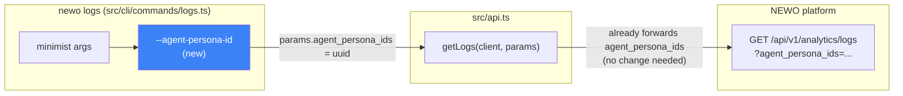

# CLI-LOGS-FILTERS: expose `agent_persona_ids` as a `newo logs` flag

> Temporary document (per `technical-design`/`write-docs` convention). Would normally be
> promoted into the JIRA ticket and `docs/adr/` and deleted once merged. Left in place here
> because this is a dogfood run with no real JIRA ticket to promote into - kept for the
> judges reviewing this run.

## Context and requirements

`newo logs` (`src/cli/commands/logs.ts`) fetches analytics logs via `getLogs`
(`src/api.ts`), which accepts `LogsQueryParams` (`src/types.ts`). The originating ticket
asked us to expose backend query params the CLI doesn't yet surface as flags:
`project_idn`, `external_event_id`, `runtime_context_id`, `user_persona_ids`,
`user_actor_ids`, `agent_persona_ids` - reconciled against the real filters the Builder
UI's Conversations/Logs view exposes, not a mechanical dump of every backend param name.

**Grounding in the current code turned up a stale ticket premise.** As of this repo's
`main` (`7c38b57`), the CLI already has flags for 5 of the 6 named params:

| Backend param | Existing CLI flag |
|---|---|
| `project_idn` | `--project` |
| `external_event_id` | `--event-id` |
| `runtime_context_id` | `--runtime-id` |
| `user_persona_ids` | `--persona-id` |
| `user_actor_ids` | `--actor-id` |
| `agent_persona_ids` | *(none)* |

So the real, current gap is exactly one param: `agent_persona_ids`. Chrome research (see
run log) against the Builder UI's own analytics-logs filter drawer (reached via
Conversations -> "Show Logs") confirms every other filter the UI exposes for this endpoint
already has a CLI equivalent (Log Level -> `--level`, Log Type -> `--type`, message ->
`--message`, project/flow/skill Idn -> `--project`/`--flow`/`--skill`, Runtime Context Id
-> `--runtime-id`, External Event Id -> `--event-id`, the `User: Persona/Actor` toggle ->
`--persona-id`/`--actor-id`), and surfaces exactly one filter the CLI is missing: an
`Agent` field, which is a persona picker (autocomplete showing persona names and `Id:
<uuid>`) - i.e. `agent_persona_ids`. That field is genuinely useful (filtering logs to
what one agent persona said/did is a real workflow a support engineer or developer would
want) and the backend already accepts it, so this is a pure CLI-surface addition, not a
"note as a gap" case.

The Conversations panel's separate `Session Id` filter belongs to a different endpoint
(`bff/conversations/acts?session_id=`, see `docs/SESSION_CHRONICLE_PLATFORM_ASK.md`) that
is already served by the CLI's `conversations`/`session` commands, not `logs` - out of
scope here.

## Architecture overview

Only the CLI-argument layer changes. `LogsQueryParams.agent_persona_ids` and its
querystring forwarding in `getLogs` already exist and are unmodified - this is a one-line
wiring addition plus help/docs/tests, not a new backend integration.

## Interface / API / BFF

Not applicable in the versioning/breaking-change sense - no HTTP contract changes.
Per `interface-design.md`'s checklist:
- No new/changed endpoint - reusing the existing, already-implemented
  `GET /api/v1/analytics/logs?agent_persona_ids=...` param.
- No idempotency concern - read-only `GET`, already covered by the existing pagination/
  retry-free semantics of `getLogs`.
- No new query pattern needing an index - `agent_persona_ids` is an existing, presumably
  already-indexed filter on the backend (out of this repo's control; the CLI is a pure
  passthrough).
- CLI flag naming: follows the existing sibling flags exactly -
  `--persona-id`/`--actor-id`/`--event-id`/`--runtime-id` are all singular, hyphenated,
  single-value flags mapped 1:1 onto a `..._id`/`..._ids` backend field via
  `String(args[...])` with no comma-splitting. `--agent-persona-id` matches that
  convention (singular flag name despite the backend field being named `..._ids` plural,
  exactly mirroring how `--persona-id` already maps to `user_persona_ids` and `--actor-id`
  to `user_actor_ids`). No multi-value support is added, consistent with those two
  siblings - inventing comma-split support for only the new flag would be an
  inconsistency, not an improvement.

## Data model

No data model changes. No new fields, entities, or indexes - this is a CLI flag added
against an already-existing, already-wired backend query param.

## Subtask-decomposition seed

1. **st-01** - Add `--agent-persona-id <uuid>` flag to `handleLogsCommand`, wire it to
   `params.agent_persona_ids`, update the module usage comment and `printLogsHelp()`,
   update `README.md`'s `logs` section, and add a CLI-level test (mirroring the existing
   `withMockNewoApi` + `runCli` pattern) asserting the flag reaches the querystring.

Single subtask - decompose-work confirmed this doesn't need splitting further (one file's
worth of change, no independently-mergeable sub-behaviors).

## Test and coverage strategy

Coverage floor: repo default (no stated floor in `AGENTS.md` beyond "extend to
`npm run test:coverage` for significant changes"; this is a small, low-risk change, so the
loop's default `{ diff: 95, avg: 85 }` is treated as aspirational context, not a hard gate
this repo's CI enforces - matching AGENTS.md's actual stated bar).

- **Unit/CLI-integration level** (this repo's actual test shape - Node's built-in test
  runner against the compiled `dist/`, not vitest/jest): add one test to
  `test/logs-command.test.js` that spawns the real built CLI (`runCli`) against a real
  local mock HTTP server (`withMockNewoApi`), passes `--agent-persona-id <uuid>`, and
  asserts the server received `agent_persona_ids=<uuid>` in the querystring. This is the
  same pattern the existing `--raw`/`--name` CLI tests already use, and it exercises the
  real code path end to end (arg parsing -> `LogsQueryParams` -> `getLogs` -> HTTP
  request), which for a CLI whose only "backend" is an HTTP client also serves as this
  ticket's E2E pass (`e2e.kind: api-integration`; no frontend surface exists in this repo).
- Not adding a redundant unit test for `getLogs`'s existing `agent_persona_ids` forwarding
  - that's pre-existing, already-shipped behavior, out of this diff's scope; testing it
  again would inflate the number without covering anything this change touches.

## Risks and open questions

- **Ticket staleness risk (already resolved above):** the ticket's list of "unexposed
  params" was already 5/6 stale against current `main`. Documented the reconciliation here
  explicitly so a reviewer isn't confused about why the diff is much smaller than the
  ticket implies.
- **Naming symmetry (already resolved):** chose `--agent-persona-id` (singular) over
  `--agent-persona-ids` (plural, matching the backend field literally) for consistency
  with the sibling flags' existing singular naming - flagged here in case a reviewer
  prefers literal parity with the backend field name instead.
- **No genuine UI-exposed/backend-unsupported gap found.** The task asked us to note, as a
  gap (not invent a backend param for), any UI filter concept the backend doesn't yet
  support. Chrome research found none for the `logs`-equivalent panel - everything the UI
  exposes there is already backed by an existing `LogsQueryParams` field. (The
  Conversations-level `Session Id` concept is out of scope, per Context above, and is
  already served by a different, already-existing CLI command.)
