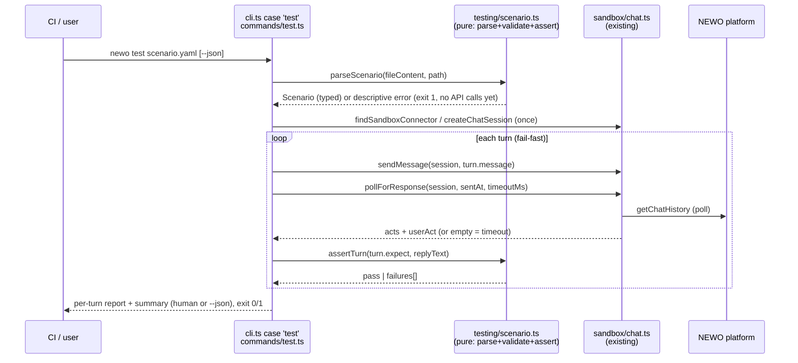

# CLI-TEST-1: `newo test` - scripted multi-turn agent scenario tests

> Temporary document. Written by `technical-design`, read by `decompose-work` and every
> `implement-subtask`. Its durable content is folded into the repo's consolidated docs
> (README, USAGE_GUIDE, CHANGELOG) and the run log, then this doc is deleted by `dev-loop`
> before the final PR opens. Do not treat this file as a permanent artifact.

## Context and requirements

Ticket: CLI-TEST-1 (synthetic; the requirements document lives in
`.claude/dev-loop/CLI-TEST-1/run-log.md`, Phase 1 section - the durable record for this
ticketless run). One sentence: add `newo test <scenario.yaml>` - a CI-able runner that
drives one scripted multi-turn conversation against a live sandbox agent and asserts on
each reply, composing only existing machinery (`sandbox/chat.ts`, chat history, logs
correlation). Why now: the CLI covers sync/edit/poke (`pull/push/diff/sandbox/logs`) but
has no repeatable agent regression gate - the edit -> push -> verify loop has no verify.

## Architecture overview



Two new files, one surgical touch to an existing one:

- **`src/testing/scenario.ts`** (new, pure - no I/O, no axios): scenario types, YAML
  parse + hand-rolled schema validation (house style: manual field checks, descriptive
  errors - the repo has no ajv/zod and this stays that way), assertion engine
  (`assertTurn`), timeout resolution (turn > scenario > CLI > 60s default). Pure so the
  whole contract is unit-testable without spawning anything.
- **`src/cli/commands/test.ts`** (new): the handler. Customer selection
  (`requireSingleCustomer` - a scenario run is inherently single-customer), auth
  (`getValidAccessToken` -> `makeClient`), connector resolution (reuse
  `findSandboxConnector` semantics and flags exactly as `sandbox.ts`), the turn loop,
  report rendering (human + `--json`), `printTestHelp()`. `--json` implies quiet: same
  console-suppression + `NEWO_QUIET_MODE` mechanics as `sandbox.ts:100-115`.
- **`src/sandbox/chat.ts`** (touch): lift `sandbox.ts`'s private `actEventId()`
  normalizer (the `'chat_history'` placeholder guard, `sandbox.ts:62-66`) into an
  exported `normalizeActEventId()` here, and re-use it from both `sandbox.ts` and
  `test.ts`. Without this, any new reader of `act.external_event_id` "successfully"
  correlates against a bogus placeholder - single source of truth for the correlation
  key.
- **`src/cli.ts`** (touch): `case 'test'` in the switch + the pre-switch
  `test --help` carve-out (the exact `printLogsHelp` pattern from origin/main), one
  summary line block in `help.ts`.

What's untouched and why that boundary is safe: `src/api.ts` and `src/types.ts` core
(all needed endpoints/params already exist - "no new backend endpoints" is a ticket
constraint); `pollForResponse` internals (its no-throw timeout contract is exactly what
the runner classifies on).

## Interface decisions

### Scenario YAML (the feature's public contract #1)

```yaml
name: order status happy path        # optional; defaults to file basename
connector: vibe_agent                # optional; CLI --connector overrides
integration: sandbox                 # optional; CLI --integration overrides
timeout: 90                          # optional, seconds; scenario-level default
turns:
  - message: "Hi"
    expect:
      contains: "Hello"              # string or list; AND semantics
  - message: "Where is my order 123?"
    timeout: 120                     # per-turn override
    expect:
      contains: ["order", "123"]
      not_contains: "error"
      regex: "order\\s+#?123"        # JS RegExp, no flags (case-sensitive)
```

Validation is exhaustive and runs before any API call: unknown top-level or turn keys
are errors (catches typos like `expects:`), `turns` non-empty, every turn has `message`
(string) and `expect` (object with at least one known key), `regex` must compile,
timeouts must be finite positive numbers. Error style matches the repo's descriptive
convention: `scenario file: <path> - turns[2].expect: unknown key "conatins" (known:
contains, not_contains, regex)`.

CLI-level precedence (locked at Gate 1): turn `timeout` > scenario `timeout` >
`--timeout` > 60s (the `sandbox` default).

### Reply text (what assertions run against)

A turn's reply = the `source_text` of **all** agent acts returned by that turn's poll
window, joined with `\n` in act order. Rationale: agents frequently answer in multiple
chat bubbles; asserting only the last act would make `contains` flaky against message
splitting, which is presentation, not behavior. Timeout = zero agent acts within budget
-> turn status `timeout` (recall: `pollForResponse` returns empty, never throws - the
runner classifies, it does not catch).

### JSON output (public contract #2)

One object on stdout, nothing else (quiet mode as in `sandbox --json`):

```jsonc
{
  "scenario": "order status happy path",
  "file": "scenarios/order-status.yaml",
  "connector_idn": "vibe_agent",
  "passed": false,
  "summary": { "total": 3, "passed": 1, "failed": 1, "skipped": 1 },
  "elapsed_ms": 12345,
  "turns": [
    { "index": 1, "message": "Hi", "status": "pass", "elapsed_ms": 2100,
      "response": "Hello! ...",
      "user_external_event_id": "...", "agent_external_event_id": "...",
      "flow_idn": "...", "skill_idn": "...", "session_id": "..." },
    { "index": 2, "message": "...", "status": "fail",
      "failures": ["contains \"123\": not found in response"], "response": "...", "...": "..." },
    { "index": 3, "message": "...", "status": "skipped", "reason": "aborted after turn 2 failure" }
  ]
}
```

Field names deliberately mirror `sandbox --json`'s `SandboxJsonResult` (the documented
log-correlation contract README already teaches) - a superset per turn, not a new
vocabulary. Turn `status` enum: `pass | fail | timeout | skipped`.

### Human output and exit

Per turn: `✓ Turn 1/3 PASS (2.1s)` or `✗ Turn 2/3 FAIL` followed by each failing
assertion with expected vs actual (actual truncated ~500 chars), the user-turn
`external_event_id`, and a ready-to-run `newo logs --event-id <id>` hint. Then a
summary line. Exit code: `0` all pass; `1` otherwise - **via `process.exit(1)` after
the full report is printed**, matching the repo's universal convention (zero
`process.exitCode` uses in `src/` today; fail-fast-per-scenario means there is no
run-all-then-aggregate tension - the report is complete by construction, skipped turns
included, before the exit call). Setup failures (YAML/connector/auth) print `❌ ...` and
exit 1 before any turn runs.

## Data model

All feature types live in `src/testing/scenario.ts` (feature-local, like other
commands' option interfaces - `types.ts` stays untouched):
`Scenario { name, connectorIdn?, integrationIdn?, timeoutSeconds?, turns: ScenarioTurn[] }`,
`ScenarioTurn { message, timeoutSeconds?, expect: TurnExpectation }`,
`TurnExpectation { contains?: string[], notContains?: string[], regex?: string }`
(lists normalized at parse time), `TurnResult { index, status, failures, response?,
elapsedMs, correlation? }`. Strict-TS notes for implementers: `noUncheckedIndexedAccess`
(guard every index), `exactOptionalPropertyTypes` (omit, never assign `undefined`),
`verbatimModuleSyntax` (`import type`), and the `case 'test'` must `break`
(`noFallthroughCasesInSwitch`).

## Subtask-decomposition seed

1. `st-01` - pure scenario module: types + parse/validate + assertion engine + timeout
   resolution, with exhaustive unit tests (node:test, flat `test()` style - no
   describe/mocha).
2. `st-02` - runner + CLI wiring (depends on st-01): `commands/test.ts`, turn loop over
   `chat.ts`, `normalizeActEventId` lift, `cli.ts` case + help carve-out, `help.ts`
   line, spawn-CLI integration tests against the `logs-command.test.js`-pattern mock
   server (loopback `listen(0)`, 10s kill guard).
3. `st-03` - docs (depends on st-02): README table row + feature subsection with the
   YAML example, USAGE_GUIDE scenario + command-reference row, CHANGELOG `[Unreleased]`
   entry, example scenario file at `examples/scenario.example.yaml`.

## Test and coverage strategy

Coverage floor: the loop default `{ diff: 95, avg: 85 }`. Honest note: this repo has no
diff-coverage tooling wired into CI, so the floor is enforced by test completeness
against the seven Gate-1 success criteria rather than a meter - `scenario.ts` is pure
and gets exhaustive branch-level unit tests (every validation error path, every
assertion combination, timeout precedence table); `test.ts` is exercised end-to-end via
the spawn-CLI mock-API harness (exit codes, JSON shape, skip-after-failure, timeout
classification, no-API-calls-before-validation via the recorded `requests[]`). New tests
must follow the **working** node:test pattern only (`test/logs-command.test.js`,
`test/sandbox-skill-commands.test.js`); the 6 mocha-style suites are pre-existing broken
(`npm run test:unit`) - per implement-subtask step 4, report that gate's status honestly,
never paper over it.

E2E kind for the manifest: `api-integration`.

## Risks and open questions

- **Turn budget in CI**: worst case is `turns x timeout` (serialized polls). Mitigation:
  document the math in README; per-turn timeouts keep it bounded; no retries by design.
- **Reply-window bleed**: a slow agent act from turn N arriving during turn N+1's poll
  window could attribute text to the wrong turn. `pollForResponse` already filters acts
  by `datetime > sentAt - 100ms` per turn, which bounds this; residual risk accepted for
  v1 and noted in docs (same semantics `sandbox --actor` continuation already has).
- **Persona/actor accumulation**: one persona+actor pair created per run, never deleted
  (no delete endpoint exists; same as `sandbox` today). Documented limitation.
- **`findSandboxConnector` null vs throw asymmetry** (null when unconfigured, throw when
  `--connector` given but wrong): the runner must handle both as setup failures with the
  helper's own descriptive text - implementers: do not "fix" the asymmetry in chat.ts.
